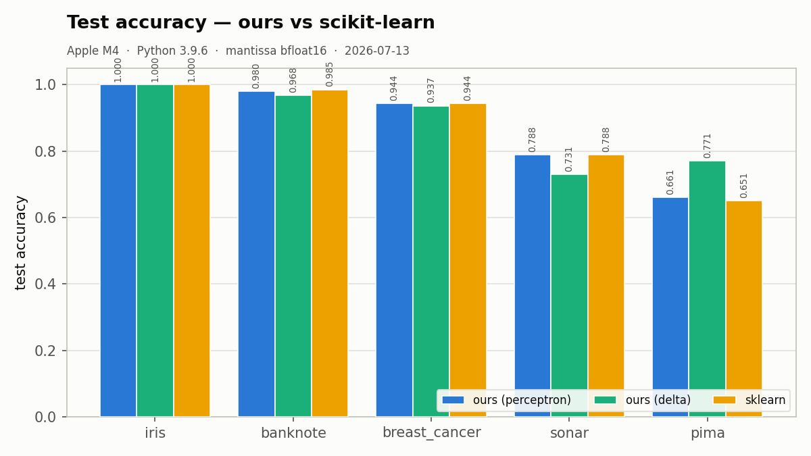
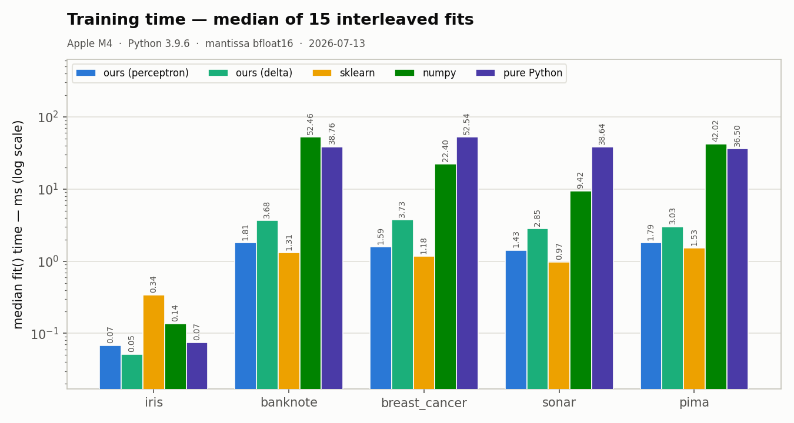
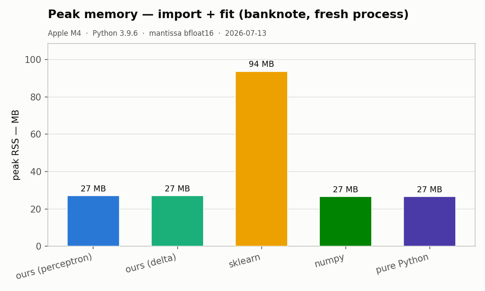

# mantissa-perceptron


**Rosenblatt's perceptron, with a C engine.**

A minimal binary classifier (`fit` / `predict` / `score`) whose compute runs
in [mantissa](https://github.com/tekinertekin/mantissa) — a fast, memory-lean
neural-network core in C. The Python layer is thin on purpose: the forward
pass, and under the delta rule the entire training step, happen in C on
zero-copy float32 buffers.

Two classic rules, both honest about what they are:

- `rule="perceptron"` — Rosenblatt (1958), mistake-driven; converges in
  finitely many mistakes on linearly separable data (Novikoff, 1962).
- `rule="delta"` — Widrow-Hoff LMS / ADALINE (1960); each step is a single
  `tk_train_step_f32` call into the engine. The one to use when the data is
  not separable.

Minimal on purpose: binary only, dense float32, no multiclass, no sparse.
sklearn-like interface, not sklearn-compatible.

## Install

```sh
pip install mantissa-perceptron   # TODO(packaging): confirm final names
```

Development layout: clone this repo next to
[mantissa](https://github.com/tekinertekin/mantissa) and build the engine
(`make dist` there); the package finds the sibling checkout automatically.

## Quickstart

```python
from mantissa_perceptron import Perceptron, datasets

X, y = datasets.load("banknote")            # prints the curl command if missing
Xtr, Xte, ytr, yte = datasets.split(X, y)   # seeded, stratified, standardized
clf = Perceptron().fit(Xtr, ytr)
print(clf.score(Xte, yte))
```

## Datasets

Five small classics (UCI + the standard Pima mirror). **Nothing downloads
implicitly** — `data/` is gitignored and library code never touches the
network. Fetch explicitly:

```sh
python -m mantissa_perceptron fetch all     # or a single name
python -m mantissa_perceptron list
```

| name | n | d | task |
|------|---|---|------|
| iris | 100 | 4 | setosa vs versicolor (linearly separable) |
| banknote | 1372 | 4 | genuine vs forged banknotes |
| breast_cancer | 569 | 30 | WDBC malignant vs benign |
| sonar | 208 | 60 | mine vs rock |
| pima | 768 | 8 | diabetes onset |

## Results

### Accuracy

<!-- BEGIN:ACCURACY (owned by Dev A — bench/accuracy.py output; do not edit outside these markers) -->
Test accuracy on the held-out 25% (stratified split, seed 42, features
standardized on train statistics only), 100 epochs. The `perceptron` rule
uses `lr=1.0` (the boundary is lr-invariant at zero-init); the `delta`
(ADALINE) rule's `lr` is tuned per dataset on the **train set only** over
{0.001, 0.003, 0.01, 0.03}. Numbers as measured by `python -m bench.accuracy`.

| dataset | n | d | rule | lr | train acc | test acc | epochs run | converged |
|---|---|---|---|---|---|---|---|---|
| iris | 100 | 4 | perceptron | 1 | 1.000 | 1.000 | 3 | yes |
| iris | 100 | 4 | delta | 0.001 | 1.000 | 1.000 | 1 | yes |
| banknote | 1372 | 4 | perceptron | 1 | 0.989 | 0.985 | 100 | no |
| banknote | 1372 | 4 | delta | 0.001 | 0.980 | 0.968 | 100 | no |
| breast_cancer | 569 | 30 | perceptron | 1 | 0.984 | 0.951 | 100 | no |
| breast_cancer | 569 | 30 | delta | 0.001 | 0.970 | 0.937 | 100 | no |
| sonar | 208 | 60 | perceptron | 1 | 0.949 | 0.788 | 100 | no |
| sonar | 208 | 60 | delta | 0.001 | 0.910 | 0.731 | 100 | no |
| pima | 768 | 8 | perceptron | 1 | 0.656 | 0.672 | 100 | no |
| pima | 768 | 8 | delta | 0.001 | 0.780 | 0.771 | 100 | no |

iris is linearly separable, so the perceptron converges to a perfect
boundary (Novikoff). banknote and breast_cancer are nearly separable. On
the non-separable sets the honest picture shows: sonar (60 features, 208
samples) overfits — high train, weak test; pima is genuinely hard for a
linear model, and there the delta rule's smoother LMS objective beats the
oscillating mistake-driven rule on both train and test.
<!-- END:ACCURACY -->

### Speed and memory vs famous implementations

<!-- BEGIN:BENCH (owned by Dev B — bench/speed.py + bench/plots.py; do not edit outside these markers) -->
*Pending — produced by `python -m bench.speed` and `python -m bench.plots`.*




<!-- END:BENCH -->

### Methodology

Fixed protocol: stratified 75/25 split (seed 42), features standardized on
train statistics only, epochs capped identically for every contender.
Timings are medians over interleaved repeats on one machine (library
versions and CPU recorded in `bench/results/speed.json`); peak RSS is
measured per contender in a fresh subprocess, import cost included, because
that is what a user pays. *Measure, don't assume.*

## License

MIT — © Tekin Ertekin. Engine:
[mantissa](https://github.com/tekinertekin/mantissa), same author, MIT.
